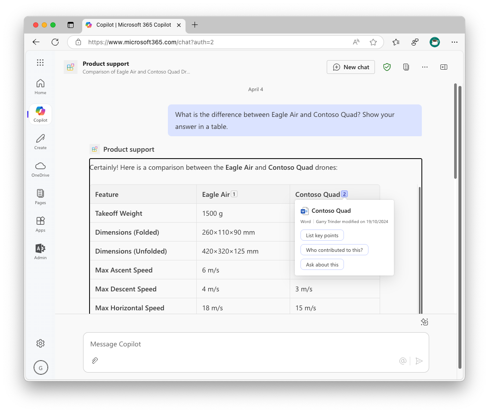

# Product support declarative agent

This sample demonstrates how to extend Microsoft 365 Copilot with a declarative agent to help with product support scenarios. The agent is designed to assist customer support employees by answering questions related to a range of products.

It uses content from the product's documentation stored in Microsoft 365 to provide accurate and relevant answers.

> [!NOTE]
> This sample uses a folder in OneDrive to store documents for ease of use, however you can use SharePoint Online using the same approach. The only difference is that you will need to use a SharePoint URL instead of a OneDrive URL.

## Prerequisites

- Visual Studio Code with Teams Toolkit extension installed
- Microsoft 365 tenant with custom app upload enabled
- Microsoft 365 Copilot license

## Setup document repository

1. Go to [OneDrive](https://www.microsoft365.com/onedrive)
1. Go to **My files**
1. Create a new folder called **Products**
1. Upload documents from the **docs** folder in this repository to the **Products** folder
1. Navigate to the **Products** folder
1. Expand the **Details** tab on the right
1. Expand the **More details** tab
1. Copy the Path to the Products folder using the **Copy** button

## Provision agent

1. Open the project in Visual Studio Code
1. Open **appPackage/declarativeAgent.json**
1. Update the `{URL}` placeholder with the path to the Products folder you copied in the previous step.
1. Open Teams Toolkit from the left sidebar
1. Select **Provision**
1. If prompted, sign in to your Microsoft 365 account
1. Wait for the provisioning to complete

## Test the agent

1. Press <kbd>F5</kbd> to launch a browser window
1. In the browser window, expand the **Chats** panel on the right
1. Select the **Product support** agent

Try the following prompts:

- What can you do?
- Tell me about Eagle Air?
- Recommend a product for a farmer.
- What is the difference between Eagle Air and Contoso Quad? Show your answer in a table.
